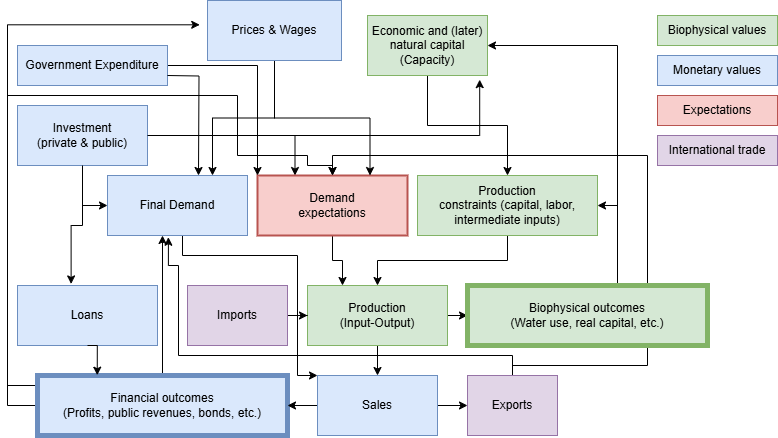

# KAUST Economy-Nature (KEN) model: A generalizable economic-biophysical SFC-IO framework
## Public releases of the KAUST Economy-Nature (KEN) model, developed and maintained at the KAUST Systems Science Lab

## Remarks on current version 1.1
This version of the KEN model (version 1.1) is a slightly updated version as compared to the KEN model description and first preprint version 1, which is forthcoming on SSRN:
“Transformation dynamics of an energy-rich and water-scarce economy in the Middle East”.

Modifications for KEN version 1.1:
1. Slight consistency issues corrected in the import section of the endogenous industrial policy module endogenize_input_output_matrix_A.py (difference in new calculation of imports is less than 0.2% of GDP with previous version, according small changes in GDP)
2. GDP identity additionally enforced and checked at several points in model.py files
3. Small flow effects have large stock effects: small changes in imports cause noticeable movements in government external assets (SAMA + PIF) and thus government net wealth through compound effects (interest on Saudi sovereign wealth fund) due to the improving trade balance. This demonstrates the sensitivity of the model w.r.t. trade and other factors closing the model.
4. GDP identity figure added in run_model_COMPARE_scenarios.ipynb to clarify the composition of GDP in % for the different scenarios.

## Content:
- KEN Model: Data, code, visualizations, and run files.

## Documentation
See "Transformation dynamics of an energy-rich and water-scarce economy in the Middle East" under this link: (SSRN preprint link forthcoming).

## To prepare your local system:

- Install Python >= 3.12 from [python.org](https://www.python.org/downloads/) or [Anaconda](https://www.anaconda.com/download)
- Install requirements with `pip install -r requirements.txt`
- Install an IDE that supports Jupyter Notebooks such as [jupyter lab](https://jupyter.org/) or [VS Code](#vscode-tips) (see [VS Code Tips](#vscode-tips))

## To use the model:
- SINGLE scenario:     Run the model in `run_model_SINGLE_scenario.ipynb` (One single scenario one, many detailed analyses)
- SCENARIO COMPARISON: Run the model in `run_model_COMPARE_scenarios.ipynb` (Runs to compare all three scenarios, comparative graphs)

## Learning material:

- vscode (see [VS Code Tips](#vscode-tips))
- python https://docs.python.org/3/tutorial/index.html
- jupyter notebooks https://docs.jupyter.org/en/latest/
- numpy https://numpy.org/doc/stable/
- pandas https://pandas.pydata.org/docs/
- scipy fsolve https://docs.scipy.org/doc/scipy/reference/generated/scipy.optimize.fsolve.html

## Model structure

Overview of the calculation order and dependencies of each variable.


## VSCode Tips

Install VSCode: https://code.visualstudio.com/

Recommended extensions to install: jupyter, pylance, prettier

How to use Jupyter notebooks in VSCode: https://code.visualstudio.com/docs/datascience/jupyter-notebooks

Recommendations for [`settings.json`](https://code.visualstudio.com/docs/getstarted/settings#_settingsjson)

```json
{
  "[python]": {
    "editor.defaultFormatter": "ms-python.autopep8",
    "editor.formatOnSave": true
  },
  "python.analysis.typeCheckingMode": "basic",
  "notebook.defaultFormatter": "ms-python.autopep8",
  "notebook.formatOnSave.enabled": true
}
```
